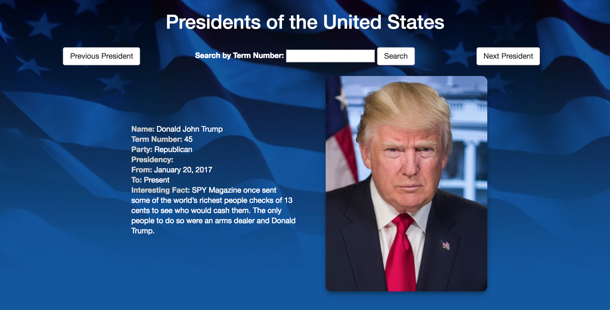

# US Presidents
A Java web application that displays important and interesting information about all US presidents. This was our week 6 project in the Skill Distillery Full-Stack Java Web Development Bootcamp.

## In This Document:
1. [Application URL](#application-url)
2. [How to Use the Application](#how-touse-the-application)
3. [Architecture and Technologies Used](#architecture-and-technologies-used)

## Application URL
http://www.shaundashjian.com:8080/USPresidents

## How to Use the Application
* When first accessing the website, picture and information about president George Washington is displayed
* Click Next to display the next president
* Click Previous to display the previous president
* Enter a president term number and click Search to display the specific president
* If the  user enters an invalid term number, an "Invalid term number" message is displayed and display defaults to George Washington

## Architecture and Technologies Used
The application uses the MVC architecture with JSP and servlets.

1. **The DAO:**
The DAO (Data Access Object) reads the data of all presidents from a file and stored it in a HashMap. It provides a getPresident() method to pass a President object to the servlet.
2. **The Servlet:**
The servlet gets the President information from the DAO and maintains session-specific information per user to keep track of which president is currently displayed. If the user goes past the last president it goes back to the first president and if the user goes below the first president it moves to the last.
3. **The JSP:**
The JSP uses [Bootstrap](http://getbootstrap.com). It displays the current president picture and information. It has a text box and a Search button to search by term number as well as Next and Previous buttons to scroll through. If the  user enters an invalid term number, the JSP displays an "Invalid term number" message and defaults to dispaly George Washington.
